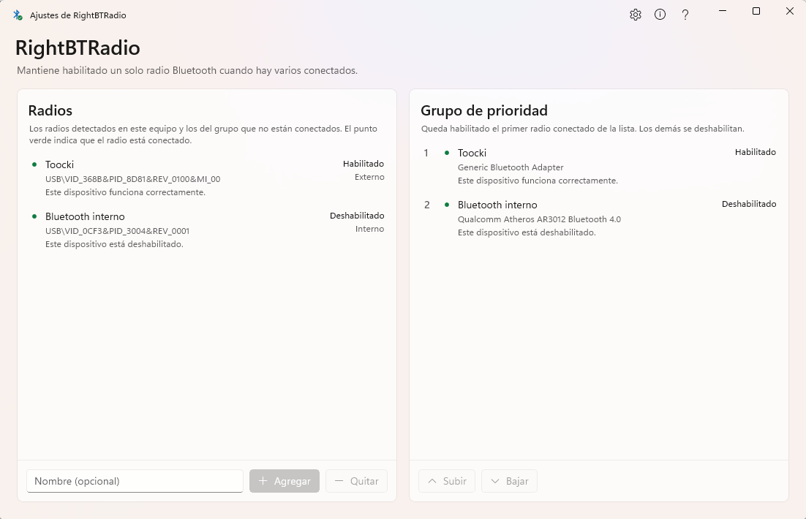

# RightBTRadio

Utilidad para Windows que mantiene habilitado un solo radio Bluetooth cuando hay
varios conectados.

Usted ordena sus radios en un grupo de prioridad. Cada vez que se conecta o se
desconecta un dispositivo, la aplicación deja habilitado el primer radio conectado del
grupo y deshabilita los demás.



## Descarga

La última versión está en [Releases](https://github.com/n-a-monterocarvajal/RightBTRadio/releases).
Descargue `RightBTRadio-<versión>-Setup.exe` y ejecútelo. El instalador pide permiso
de administrador una vez.

## Por qué existe

Windows no puede usar dos radios Bluetooth a la vez, aunque sí maneja dos adaptadores
Wi-Fi. Con los dos conectados, uno queda con el código de problema 31,
`CM_PROB_FAILED_INSTALL`, porque Windows no carga su controlador. Si conecta un
adaptador USB a un equipo con Bluetooth integrado, uno de los dos deja de funcionar, y
la única solución manual es entrar al Administrador de dispositivos cada vez.

Deshabilitar el radio que pierde no alcanza, porque el nodo del ganador no se recupera
solo cuando desaparece el conflicto. En pruebas con hardware real,
`CM_Reenumerate_DevNode` con `CM_REENUMERATE_RETRY_INSTALLATION` dejó el problema 31
intacto. Deshabilitar y volver a habilitar el nodo del ganador lo llevó a 0 en unos
segundos. Por eso `--apply` termina con ese ciclo cuando el ganador tiene un problema.

Falta comprobar si ese ciclo es la única vía. El comentario `ponytail:` de
`RadioService.cs` enumera las alternativas sin probar, y hay un
[issue abierto](https://github.com/n-a-monterocarvajal/RightBTRadio/issues/1) para
investigarlas.

## Instalación

El instalador pesa 7,7 MB. Si faltan el .NET Desktop Runtime o el Windows App Runtime,
los descarga con los instaladores oficiales de Microsoft. Si ya están instalados, no
descarga nada. La aplicación queda en `%ProgramFiles%\RightBTRadio`, y el instalador
registra las dos tareas programadas que hacen el trabajo con privilegios de
administrador. Después, la aplicación no vuelve a pedir permisos.

Requiere Windows 10 versión 1809 o posterior, de 64 bits. Solo se probó en Windows 11.

Al desinstalar, primero se habilitan todos los radios y después se borran los
archivos. Así, quien desinstale con un radio deshabilitado no se queda sin él.

## Interno y externo

Windows indica sin ambigüedad si un radio viene integrado o se puede quitar. Estos son
los valores medidos en hardware real:

| | Radio externo | Radio interno |
|---|---|---|
| `RemovalPolicy` | 3, `CM_REMOVAL_POLICY_EXPECT_SURPRISE_REMOVAL` | 1, `CM_REMOVAL_POLICY_EXPECT_NO_REMOVAL` |
| `InLocalMachineContainer` | falso | verdadero |
| `ContainerId` | propio | `{00000000-0000-0000-FFFF-FFFFFFFFFFFF}` |
| `EnumeratorName` | USB | USB |

El nombre del enumerador no sirve para distinguirlos. La política de extracción sí, y
`BluetoothRadios` la lee.

**La prioridad no usa este dato, a propósito.** La lista del grupo ya es un orden
total, así que una clasificación en dos categorías solo podría repetirla o
contradecirla. Con un radio interno y un adaptador USB, basta con saber si el
adaptador está conectado, porque Windows no enumera un adaptador desenchufado. Con dos
internos o dos externos, el dato no distingue nada. La ventana lo muestra junto al
estado de cada radio y no se usa para nada más.

El estado del sistema sí influye en el orden inicial. Al agregar un radio habilitado,
entra por encima de los que están deshabilitados, porque un radio que el usuario
deshabilitó por su cuenta indica una preferencia. Después, el orden lo decide el
usuario con los botones Subir y Bajar.

## Permisos de administrador

Windows exige privilegios de administrador para habilitar y deshabilitar nodos PnP.
Aun así, el residente se ejecuta sin elevación. De ese modo puede arrancar desde la
clave `Run` y aparece en Configuración → Aplicaciones → Inicio con su propio
interruptor.

El trabajo con privilegios lo hacen dos tareas programadas con
`RunLevel HighestAvailable`: `RightBTRadio.Apply` y `RightBTRadio.EnableAll`. El
residente las lanza con `schtasks /Run`. El instalador las registra, y si faltan, la
aplicación pide permiso una vez para registrarlas. Las tareas son por usuario, así que
otro usuario del mismo equipo las registra al abrir la aplicación.

Son dos tareas y no una con argumentos porque `schtasks /Run` no permite pasar
argumentos a la acción.

## Estructura

| Proyecto | Contenido |
|---|---|
| `RightBTRadio.Core` | Enumeración de radios, control de nodos PnP, ajustes, resolución de prioridad, tareas programadas y contrato visual. No tiene interfaz. |
| `RightBTRadio` | Residente del área de notificación (WinForms) y modos de línea de comandos. Se ejecuta sin elevación. |
| `RightBTRadio.WinUI` | Ventana de ajustes en WinUI 3, con Mica. Es un proceso aparte que se abre cuando se necesita. |
| `RightBTRadio.Tests` | Pruebas de la resolución de prioridad, del filtro de enumeradores, de los ajustes y de la lectura de tareas. |

Los ajustes se guardan en `%LocalAppData%\RightBTRadio\preferences.json`. Solo la
ventana de ajustes los escribe; el residente solo los lee. Por eso no hace falta
comunicación entre procesos, a diferencia de RightKeyboard.

## Compilar y probar

```
dotnet build RightBTRadio.slnx
dotnet test RightBTRadio.slnx
```

Compile siempre la solución completa. Un proyecto compilado por separado escribe en
otra carpeta de salida, y el residente o el arnés podrían usar un binario viejo.

## Modos de línea de comandos

Sirven para probar durante el desarrollo y son lo que ejecutan las tareas programadas.
Los dos primeros requieren permisos de administrador.

```
RightBTRadio.exe --apply              # aplica la prioridad y sale
RightBTRadio.exe --enable-all         # habilita todos los radios y sale
RightBTRadio.exe --list               # muestra los radios detectados y su código de estado
RightBTRadio.exe --register-tasks     # registra las dos tareas programadas
RightBTRadio.exe --unregister-tasks   # elimina las tareas
```

## Arnés de interfaz

```
pwsh -File scripts/ui-harness.ps1
```

El arnés compila la solución, abre la ventana de ajustes y comprueba lo que declara
`RightBTRadio.Core/SettingsVisualContract.cs`. Guarda una captura en
`artifacts/ui-harness/` y cierra lo que abrió. Devuelve 0 si todas las comprobaciones
pasan y 1 si alguna falla.

| Parámetro | Uso |
|---|---|
| `-Configuration` | `Debug` por omisión; `Release` para revisar lo que se publica |
| `-Attach` | Usa una ventana ya abierta en lugar de abrir otra, y no la cierra |
| `-KeepOpen` | Deja la aplicación abierta al terminar |
| `-SkipEvidence` | No guarda la captura |
| `-EvidenceDirectory` | Cambia la carpeta de la captura |

Necesita una sesión interactiva de Windows, porque `winapp ui` usa UI Automation, y el
[CLI winapp](https://github.com/microsoft/winappcli).

El script lee los textos esperados del contrato en cada ejecución en lugar de
copiarlos. Si el contrato cambia y la interfaz no, o al revés, el arnés falla. Se
comprobó cambiando el subtítulo de la ventana: el arnés marcó esa comprobación como
fallida y devolvió 1.

El arnés solo usa comandos que no simulan entrada del usuario. La captura sirve como
evidencia y no forma parte de las comprobaciones, así que se puede omitir.

El arnés no comprueba si Mica se ve de verdad (Windows usa un color sólido sin avisar
a la aplicación, y la captura sirve para verificarlo a ojo), la alineación, los
estados visuales ni la conexión física de un radio.

## Generar el instalador

```
pwsh -File scripts/build-installer.ps1
```

El script publica los dos ejecutables en una misma carpeta, dependientes del marco, y
descarta los 40 MB de Windows ML que el Windows App SDK incluye aunque la aplicación
no los usa. Después compila el instalador con Inno Setup y deja el resultado y su
SHA-256 en `artifacts/installer/`.

Con `-SkipInstaller`, publica y verifica sin ejecutar Inno Setup.

El icono se genera con código en lugar de guardarse como binario:

```
pwsh -File scripts/make-icon.ps1
```

## Origen y licencia

MIT. Consulte el archivo `LICENSE`.

La estructura base viene de [RightKeyboard](https://github.com/n-a-monterocarvajal/RightKeyboard),
que es una obra derivada en capas. La capa anterior al fork usa la licencia CPOL 1.02,
los forks intermedios no declararon licencia y solo los cambios propios del fork son
MIT.

RightBTRadio reutiliza solo archivos de la capa MIT, escritos en junio y julio de 2026:
`NativeTrayMenu.cs`, `StartupManager.cs`, `DeviceIdentityResolver.cs`,
`RawInputWindow.cs` y `TrayApplicationContext.cs`. También toma los criterios de
`SettingsPanelVisualContract.cs`, del arnés de interfaz y del instalador.

No se copió nada de la capa anterior al fork. Los dos archivos de RightKeyboard que
vienen de esa capa, `Program.cs` (importado el 7 de enero de 2020) y
`Configuration.cs` (del 13 de junio de 2020), se escribieron aquí desde cero. El
`Program.cs` de este repositorio solo comparte con aquel el
`[STAThread] static void Main` obligatorio, y `Configuration.cs` no comparte modelo ni
código. El icono tampoco se reutilizó, porque el de RightKeyboard llegó en esa misma
importación de 2020.

La detección y descarga de requisitos del instalador vienen de Collatio-Sen, del mismo
autor.
